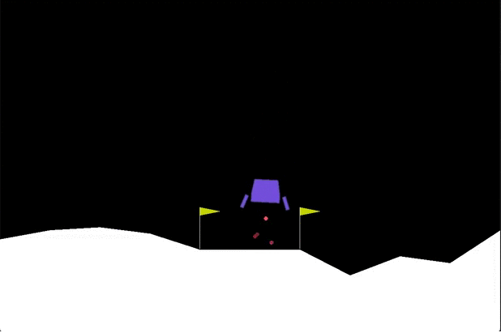
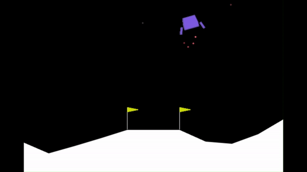
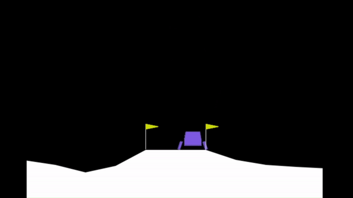
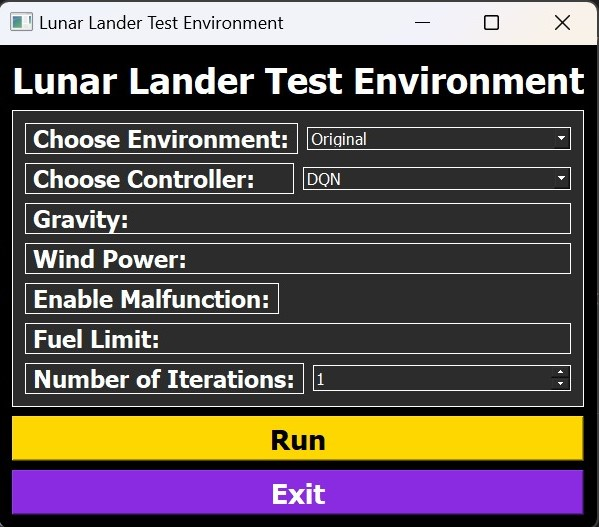

# Lunar Lander Project


### Documentation & Presentation ###

For a better experience, I encourage you to check out the following resources:
- [Project Documentation PDF](media/Lunar_Lander.pdf)
- [Video Presentation](https://youtu.be/e_nDoMwvJ1A)

## Project Overview
The Lunar Lander Project simulates a lunar landing mission with two control strategies: a PID controller and a Deep Q-Network (DQN) agent. The project includes a graphical user interface (GUI) for adjusting simulation parameters such as gravity, wind power, and fuel limits. The goal is to safely land the lunar lander using the selected control strategy.

## Train Hard, Land Smooth

### DQN Training in Progress


This GIF showcases the Deep Q-Network (DQN) learning to land the lunar lander. You can observe how the agent initially struggles.

### Successful DQN Landing


In this GIF, the DQN agent successfully lands the lunar lander after completing its training. The smooth landing demonstrates the effectiveness of the trained DQN model in handling different conditions.

## Features
- **PID and DQN Controllers**: Test and compare the performance of a PID controller and a trained DQN agent for lunar landing.
- **Customizable Environment Parameters**: Fine-tune settings like gravity, wind power, fuel limits, and malfunctions through an intuitive GUI.
- **Simulation Visualization**: Real-time graphical feedback on the lunar lander's behavior and performance.

## GUI Functionality


The GUI provides the following features:
- **Choose Environment**: Select between a Custom or Original environment for the simulation.
  - **Custom Environment**: Users can modify specific parameters, including:
    - **Gravity**: Modify gravity to test controller performance under different conditions.
    - **Wind Power**: Change wind conditions to introduce variability into the simulation.
    - **Fuel Limit**: Set fuel constraints to challenge the controllers.
    - **Malfunction**: Toggle random malfunctions to simulate real-world issues.

- **Controller Selection**: Select between the **PID** or **DQN** controller for the simulation.
- **Number of Iterations**: Define how many simulation runs should be executed.
- **Run and Exit Buttons**: Use the **Run** button to start simulations or the **Exit** button to close the application.

## Installation
To set up the project locally:

1. **Clone the Repository**:
    ```bash
    git clone https://github.com/galkalimi/Lunar_Lander.git
    cd Lunar_Lander
    ```

2. **Install Dependencies**:
   Ensure Python is installed, then install the required packages:
    ```bash
    pip install -r requirements.txt
    ```

3. **Run the Application**:
   Launch the GUI by executing:
    ```bash
    python LunarLanderGUI.py
    ```

### Usage
To begin using the Lunar Lander simulation, first launch the graphical user interface (GUI) by running the **`LunarLanderGUI.py`** file.

1. **Select an Environment**: Choose between a **Custom** or **Original** environment.
   - If you select **Custom**, you'll be able to adjust specific parameters (gravity, wind power, etc.).

2. **Select a Controller**: Choose between **PID** or **DQN** from the dropdown menu in the GUI.

3. **Set Parameters (Custom Environment)**: If you selected the **Custom** environment, adjust the following parameters as needed:
   - **Gravity**: Modify the gravity level.
   - **Wind Power**: Introduce or adjust wind conditions.
   - **Fuel Limit**: Set limits on available fuel.
   - **Malfunctions**: Toggle random malfunctions on or off.

4. **Start the Simulation**: Click the **Run** button to begin the simulation with the selected environment, controller, and parameters.

5. **Close the Application**: Click the **Exit** button to terminate the application.